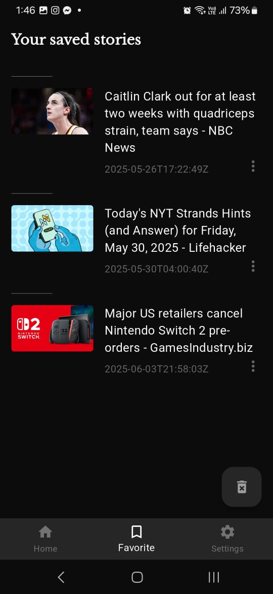
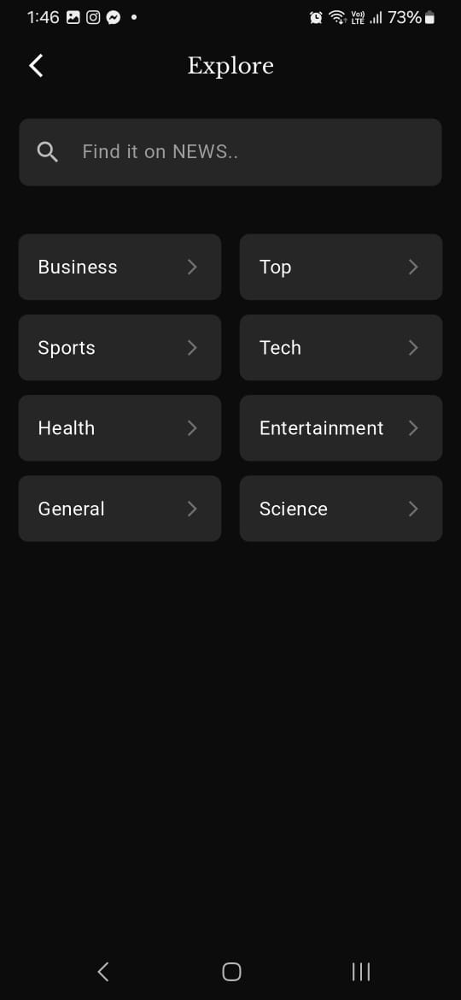
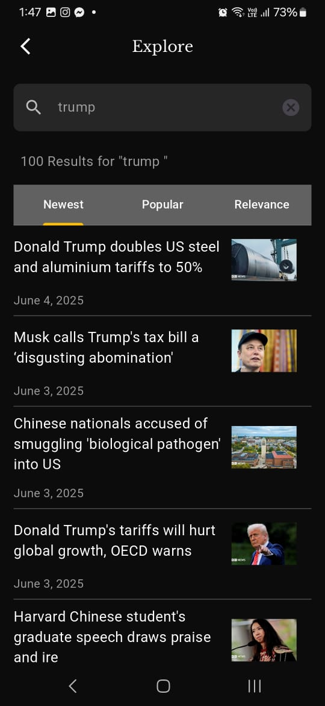
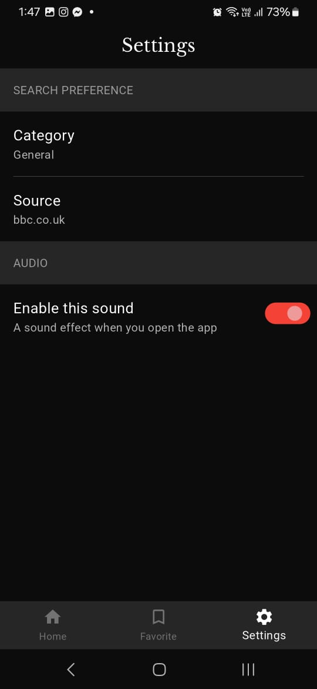
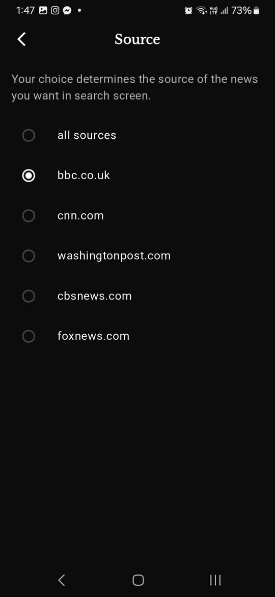

# News-App

## Table of contents
* [General info](#general-info)
* [Screenshots](#screenshots)
* [Functionality](#functionality)
* [Technologies](#technologies)
* [Setup](#setup)
* [License](#license)

## General info

News app develped by flutter and implemented with newsapi to fetch any news you want by fiter a category name, sort by ,source of the news ex:cnn,bbc and search functionality too.

## Screenshots

  






## Functionality
- Get all breaking news in the world by category.
- Share any article you want to your freinds.
- Save any article you want to read it later.
- Search any article you want by filter option.
- Settings screen to customize your search preferences.


## Technologies

#### Languages:
- Dart 

#### Platforms:
- Android and IOS

#### Libraries:
- provider            ^6.1.4
- http                ^1.3.0
- flutter_spinkit     ^5.2.1
- cupertino_icons     ^1.0.8
- share_plus          ^11.0.0
- hive                ^2.2.3
- hive_flutter        ^1.1.0
- timeago             ^3.7.1
- url_launcher        ^6.3.1
- intl                ^0.20.2
- shared_preferences  ^2.5.3
- audioplayers        ^6.4.0
- flutter_switch      ^0.3.2

## Setup

- To run this project, install it by download or clone.
- Then regiser an account on this website https://newsapi.org/docs/endpoints/top-headlines to acquire a new api key.
- Enter this api key in news_api.dart file under apiKey const [path: lib/services/news_api.dart]


#### System requirements
- Android Studio Meerkat Feature Drop | 2024.3.2
- version: 1.0.0+1
- environment: sdk: ^3.7.0
- Installed NDK: 27.0.12077973, 26.3.11579264

## License

```html
MIT Licence 

Copyright (c) 2025 Ahmed Zaki

Permission is hereby granted, free of charge, to any person obtaining a copy of this software
and associated documentation files (the "Software"), to deal in the Software without restriction,
including without limitation the rights to use, copy, modify, merge, publish, distribute, sublicense,
and/or sell copies of the Software, and to permit persons to whom the Software is furnished to do so, 
subject to the following conditions:

The above copyright notice and this permission notice shall be included in all copies or substantial 
portions of the Software.

THE SOFTWARE IS PROVIDED "AS IS", WITHOUT WARRANTY OF ANY KIND, EXPRESS OR IMPLIED, 
INCLUDING BUT NOT LIMITED TO THE WARRANTIES OF MERCHANTABILITY, FITNESS FOR A PARTICULAR PURPOSE
AND NONINFRINGEMENT.IN NO EVENT SHALL THE AUTHORS OR COPYRIGHT HOLDERS BE LIABLE FOR ANY CLAIM,
DAMAGES OR OTHER LIABILITY, WHETHER IN AN ACTION OF CONTRACT,
TORT OR OTHERWISE, ARISING FROM, OUT OF OR IN CONNECTION WITH THE SOFTWARE
OR THE USE OR OTHER DEALINGS IN THE SOFTWARE.
```


